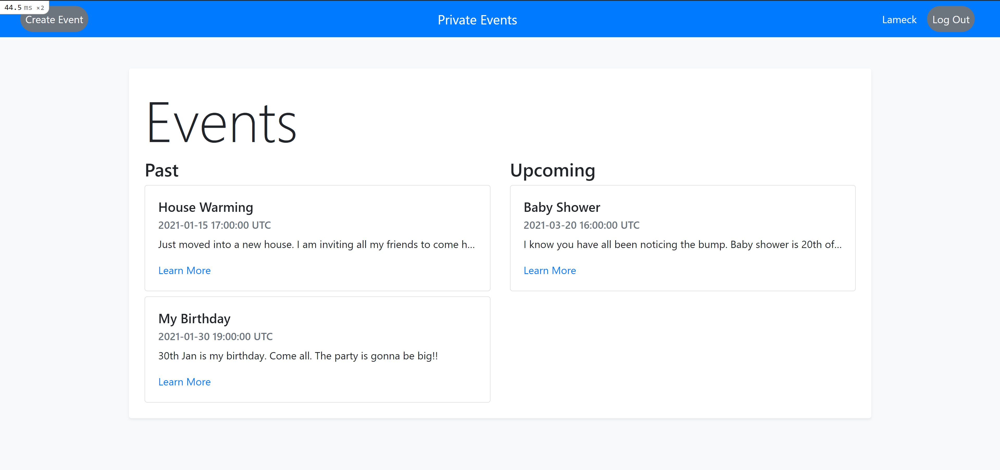

# Private Events

## Table of Contents

* [About the Project](#about-the-project)
* [Built With](#built-with)
* [Getting Started](#getting-started)
* [Prerequisites](#prerequisites)
* [Contributing](#contributing)
* [Author](#author)
* [Acknowledgements](#acknowledgements)

## About Project

Building a site similar to a private Eventbrite which allows users to create events and then manage user signups. Users can create events and send invitations.



## [Live Demo](https://createprivateevent.herokuapp.com/)

## Built With

- Ruby v2.7.2
- Rails 6.1.2
- Postgresql

## Getting Started

* Clone this repo https://github.com/Lameck1/private-events
    ```
    git clone https://github.com/Lameck1/private-events.git
    ```
* Navigate to private-events folder
    ```
    cd private-events
    ```
* On the terminal, while in the 'private-events' directory, run the following to install dependency:
    ```
    bundle install
    ```
* At this point, you still don't have the Postgress database. Run the following to get setup:

  - Ensure that postgresql service is up and runnning
        ```
        sudo service postgresql start
        ```
  - Create the database
        ```
        rails db:create
        ```

  - Migrate the database
        ```
        rails db:migrate
        ```

  - To get test data run
        ```
        rails db:seed
        ```

* To interact with the project, run:
    ```
    rails server
    ```

    OR

    ```
    rails s
    ```
* Go to the browser and enter 
    ```http://localhost:3000```

### Prerequisites

- Ensure you have these installed:
    - Git
    - Ruby 3.0.0
    - Ruby on rails ```gem install rails```

- You also need to ensure your yarn is upto date
    ```
    yarn install --check-files
    ```

## Contributing

Contributions, issues, and feature requests are welcome!

Feel free to check the [issues page](https://github.com/Lameck1/private-events/issues).

## Author

👤 **Lameck Otieno**
  - GitHub: [@githubhandle](https://github.com/Lameck1)
  - Twitter: [@twitterhandle](https://twitter.com/lameck721)
  - LinkedIn: [LinkedIn](https://www.linkedin.com/in/lameck-odhiambo-642b7077/)

## Acknowledgements

Credits go to the following for providing guides on Ruby on Rails Association
  - [**Rails Guides**](https://guides.rubyonrails.org/association_basics.html)

## Show your support

Give a ⭐️ if you like this project!
